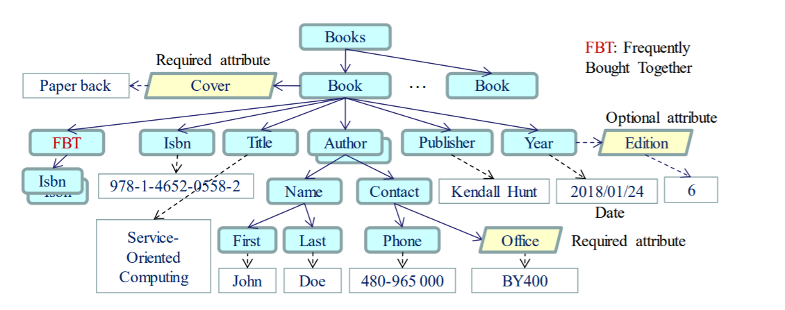

# XMLTransformations
Understanding XSLT and XSD 

Applying concepts and techniques in creating an XML file, its schema, its style sheet, and have written Web
services and an SOA application to process these files

Tryit:  https://www.public.asu.edu/~arao30/Books.xml

Refer requirement document : Read more [here](./Xml_req.pdf)

